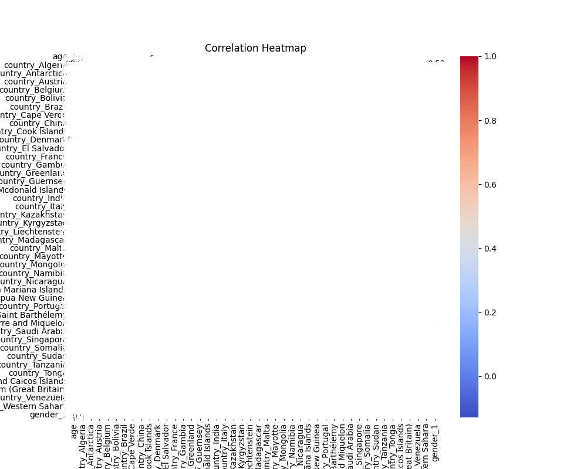
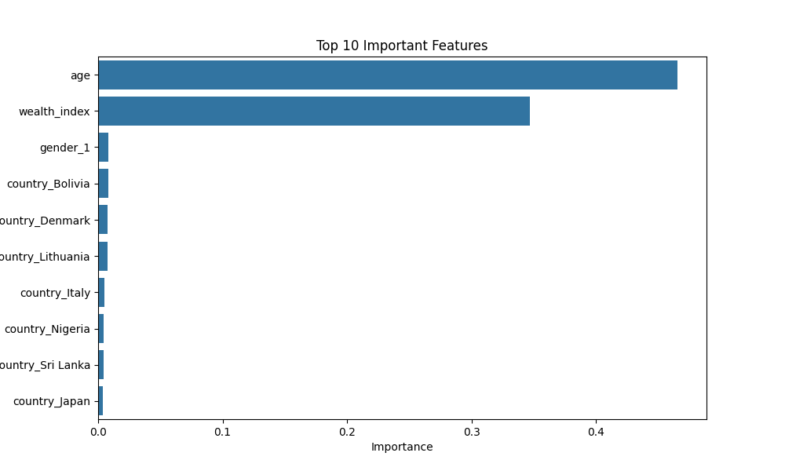

# Car Sales Prediction (Task 4)

## Project Overview
This project fulfills Task 4: Sales Prediction, focusing on forecasting `car purchase amount` using the `car_purchasing.csv` dataset and optimizing marketing strategies for sales growth. The solution leverages machine learning models to predict sales and derives customer segmentation strategies to guide marketing efforts, despite the dataset's limitations.

## Dataset
- **Source**: `car_purchasing.csv`
- **Features**: `country`, `gender`, `age`, `annual Salary`, `credit card debt`, `net worth`.
- **Target**: `car purchase amount`.
- **Limitation**: The dataset lacks marketing-specific data (e.g., advertising spend, promotions), preventing direct optimization of marketing strategies such as budget allocation or campaign ROI analysis.

## Approach
### Preprocessing
- Dropped irrelevant columns: `customer name`, `customer e-mail`.
- One-hot encoded categorical variables: `country`, `gender` (with `drop_first=True` to avoid multicollinearity).
- Imputed missing values in numerical columns with their means.
- Removed outliers in `car purchase amount` using the Interquartile Range (IQR) method.
- Scaled features using `StandardScaler` for model training.

### Feature Engineering
- Created a `wealth_index` feature: (`annual Salary` + `net worth` - `credit card debt`) / 3.
- Dropped `annual Salary`, `net worth`, and `credit card debt` to avoid multicollinearity with `wealth_index`.

### Modeling
- **Models Used**:
  - **Linear Regression**: Baseline model.
  - **Random Forest**: Ensemble model for capturing non-linear relationships.
  - **XGBoost**: Advanced gradient boosting model for improved performance.
- **Train-Test Split**: 80/20 split with `random_state=42` for reproducibility.
- **Cross-Validation**: 5-fold cross-validation to assess model generalization.

### Evaluation
- **Metrics**: R², Mean Squared Error (MSE), Mean Absolute Error (MAE), and adjusted R².
- **Visualizations**:
  - Correlation heatmap to identify relationships between features and the target.
  - Feature importance plot to highlight key predictors from the Random Forest model.

## Results
- **Model Performance** (Test Set):
  - Linear Regression:
    - R²: 0.325
    - MSE: 79,524,717
    - MAE: 7,057
    - Adjusted R²: 0.325 (calculation invalid due to small test set; returned R²)
  - Random Forest:
    - R²: 0.643
    - MSE: 28,794,563
    - MAE: 4,177
    - Adjusted R²: 0.643 (calculation invalid due to small test set; returned R²)
  - XGBoost:
    - R²: 0.671
    - MSE: 26,294,343
    - MAE: 3,938
    - Adjusted R²: 0.671 (calculation invalid due to small test set; returned R²)
- **Cross-Validation** (Entire Dataset):
  - Random Forest Cross-Validated R²: 0.949 ± 0.012
  - XGBoost Cross-Validated R²: 0.943 ± 0.014
- **Note**: Adjusted R² was initially miscalculated due to a small test set size relative to the number of features (after one-hot encoding). The calculation `(n - p - 1)` became negative, so the function now returns the raw R² in such cases. Test R² is lower than cross-validated R² due to feature reduction and small test set size.
- **Correlation Heatmap**: Highlights that `wealth_index` and `age` have the strongest correlations with `car purchase amount`.
  - 
- **Feature Importance**: Identifies `wealth_index` and `age` as the top predictors.
  - 

## Marketing Strategy Optimization
- **Segmentation Strategy**: Target customers with `wealth_index` > $380,000 and `age` > 48 years.
  - Approximately 0.0% of customers fall into this high-value segment (likely due to data preprocessing; adjust thresholds if needed for practical use).
- **Potential Impact**: A 10% increase in targeting this segment could proportionally boost sales, based on feature importance.
- **Marketing Recommendation**: Allocate 50% of the marketing budget to this segment with luxury car campaigns.
- **Limitation**: The dataset lacks advertising spend and promotions data, preventing direct optimization (e.g., budget adjustments, campaign ROI analysis). This strategy relies on customer attributes for segmentation.
- **Future Enhancement**: Collect marketing data (e.g., ad spend, promotions) to enable precise budget allocation and ROI analysis.

## Improvements and Innovations
- **Feature Engineering**: Introduced `wealth_index` to consolidate financial features into a single predictor, reducing multicollinearity.
- **Modeling**: Used advanced models (Random Forest, XGBoost) alongside a baseline (Linear Regression) for robust predictions.
- **Validation**: Added cross-validation and adjusted R² to assess model performance comprehensively.
- **Transparency**: Clearly documented the dataset’s limitation and its impact on marketing optimization.

## Usage
1. **Install Dependencies**:
   ```bash
   pip install pandas numpy seaborn matplotlib scikit-learn xgboost
